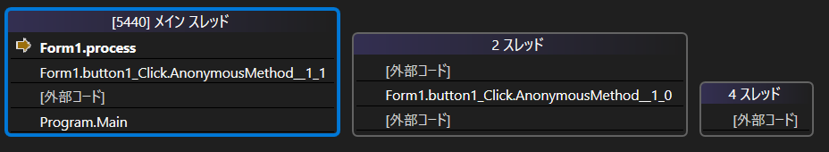

# C#のInvokeとは
バックグラウンドスレッドからUIスレッドに処理を委譲するためのメソッド

# どういうことか
例えば、以下のような処理はエラーになる

```C#
namespace WinFormsApp1
{
    public partial class Form1 : Form
    {
        public Form1()
        {
            InitializeComponent();
        }

        private async void button1_Click(object sender, EventArgs e)
        {
            await Task.Run(() => process());
        }

        private void process()
        {
            label1.Text = "非同期処理内";
        }
    }
}
```


### ※実行結果  

# なぜか
これは<strong>UIスレッド以外からUIの変更を行おうとしたためである。</strong>



上記の画像のとおり、process関数はメインスレッド（UIスレッド）以外のスレッドで実行されているのが分かる。

# ではどうするか
上記の通り、UIに関することはUIスレッドから行われなければならない。  
そこでInvokeの出番である。
Invokeメソッドにデリゲート関数を渡すことで、
先ほどの処理を書き換えてみる
```C#
namespace WinFormsApp1
{
    public partial class Form1 : Form
    {
        public Form1()
        {
            InitializeComponent();
        }

        private async void button1_Click(object sender, EventArgs e)
        {
            await Task.Run(() => label1.Invoke(new Action(() => process())));
        }

        private void process()
        {
            label1.Text = "非同期処理内";
        }
    }
}

```

Invokeメソッドは引数として渡されたデリゲートをUIスレッドに委譲する  
つまり、ここではprocess関数がUIスレッド上で実行される。  

下記からも、先ほどはバックグラウンドスレッドで行われていたprocess関数がメインスレッド（UIスレッド）上で行われていることが確認できる。


